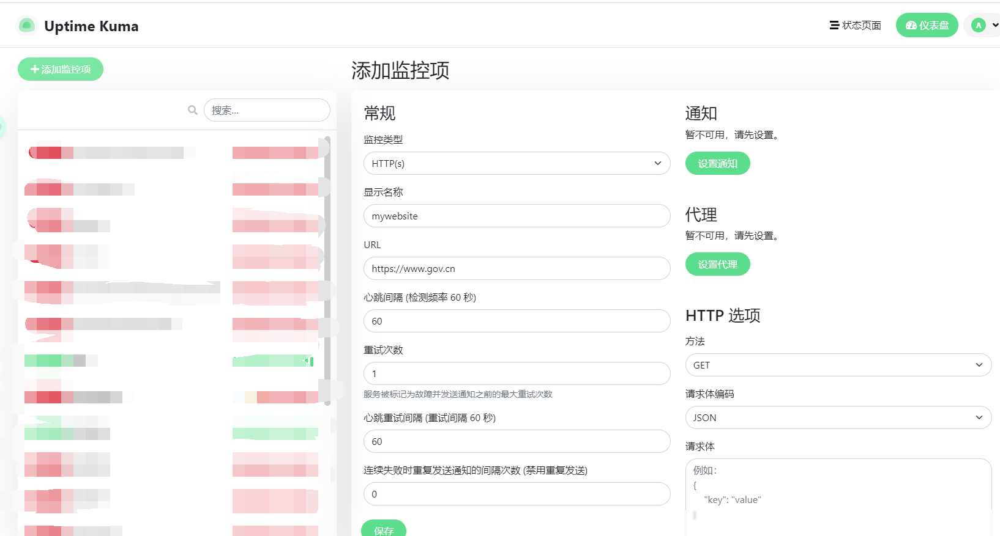
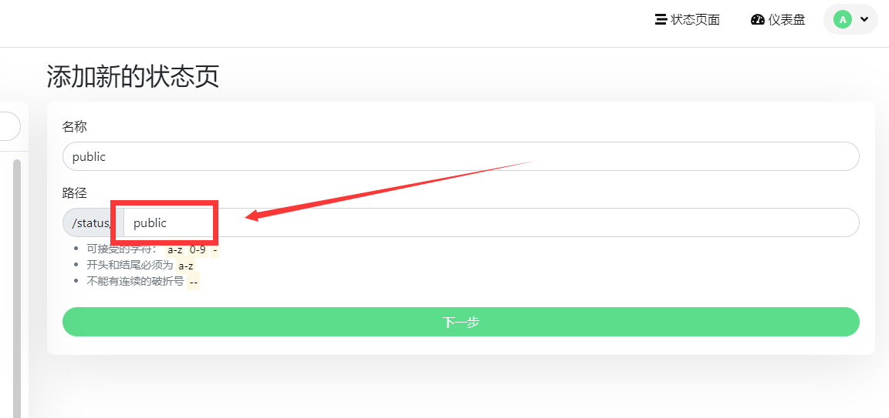
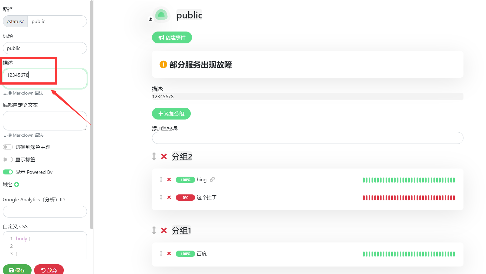

# nia-status-bot（Uptime-Kuma-qqbot）

这是一个基于 [Uptime Kuma](https://github.com/louislam/uptime-kuma) 以及 [mirai-api-http](https://github.com/project-mirai/mirai-api-http) 开发的 [QQ](https://im.qq.com/) 机器人插件

## 有什么用？

当 Uptime Kuma 中的实例掉线（即状态为0）时 nia-status-bot 会向指定的QQ群发送信息


## 如何使用？

### 配置 mirai-api-http

mirai-api-http 官方安装教程：https://docs.mirai.mamoe.net/mirai-api-http/

推荐使用手动安装

- 运行 [Mirai Console](https://github.com/mamoe/mirai-console) 生成 plugins 文件夹

- 从 [Releases](https://github.com/project-mirai/mirai-api-http/releases) 下载 `jar` 并将其放入 `plugins` 文件夹中
- 编辑 `config/MiraiApiHttp/setting.yml` 配置文件 (没有则自行创建)

```yaml
adapters: 
  - http
  - ws # 需开启websocket
debug: false
enableVerify: true
verifyKey: admin123 # 这里设置你的 key 并且越复杂越好（可通过在线 md5 加密生成复杂字符串：https://www.cmd5.com/）
singleMode: false
cacheSize: 4096
persistenceFactory: 'built-in'
adapterSettings: 
  ws:
    host: '0.0.0.0' # 监听所有 ip
    port: 11451 # 设置 websocket 监听端口
    reservedSyncID: -1
  http:
    host: '0.0.0.0'
    port: 19198
    reservedSyncID: -1

```


### 配置 Uptime Kuma

- 登录 Uptime Kuma 控制台，在仪表盘中添加监控项（若已添加可以不添加）



- 登录 Uptime Kuma 控制台，在状态页面中新建状态页，每个状态页可以设置一个接收通知的QQ群，用于监控该状态页下的所有实例

注：路径后面的内容，为机器人配置界面中的页面配置项



- 添加该状态页所需要的节点（也就是需要通知到这个群的节点），并在 `描述` 项中填写需要将通知发送到的群号



- 同样步骤添加其他状态页


### 部署 nia-status-bot

本项目要求 `Node 16` 或者以上运行环境

- 从 [Release](https://github.com/alongw/Uptime-Kuma-qqbot/releases) 下载稳定版的源码`或`克隆 [仓库](https://github.com/alongw/Uptime-Kuma-qqbot) 使用最新开发版的源码

- 使用 yarn 或 npm 等包管理器运行项目

  ```bash
  # 使用 yarn
  yarn
  yarn start
  # 使用 npm
  npm i
  npm run start
  ```

- 首次运行自动生成配置文件

- 修改配置文件

  ```yaml
  # 监听端口
  listen_port: 10088
  # 机器人账号
  qq: 1287756886
  # 监控时间（多久监控一次 毫秒）
  monitor_time: 60000
  
  # mirai-api-http 配置（使用ws）
  mirai_api_http:
    # mirai-api-http 服务器地址 不需要加http/https,后面也不需要加斜杠
    host: 10.0.0.200
    # mirai-api-http 服务器端口
    port: 8080
    # mirai-api-http authKey
    key: 123456
  Uptime_Kuma:
    # Uptime-Kuma 服务器地址 后面不需要加斜杠
    host: http://www.gov.cn
    # 需要监听的页面
    listen_page: 
      - test
      - test2
      - adminserver
  ```

  注意几点： 

  - 建议将 `监控时间` 与 `Uptime Kuma` 中的时间设置一致

  - `监听端口` 目前没有什么用，但是在未来可能会进行开发，可为 `nia-status-bot` 预留一个web端口（目前不会占用）

  - `mirai-api-http 配置` 中的 `key` 就是在配置 `mirai-api-http` 的时候配置文件中的 `verifyKey`

  - `Uptime_Kuma` 配置中的 `listen_page` 需要填写在配置 `Uptime Kuma` 时 `状态页` 中的路径中的 `/status/` 后面的内容

    

## 已知问题

由于 ~~资金问题~~ ，目前并不能很好的判断服务器的以往状态和通知情况，因此在部分极端条件下会出现重复通知或者不通知的问题

新的判断方式将会在往后的版本中更新（服务器上线通知也是，目前版本还没有）